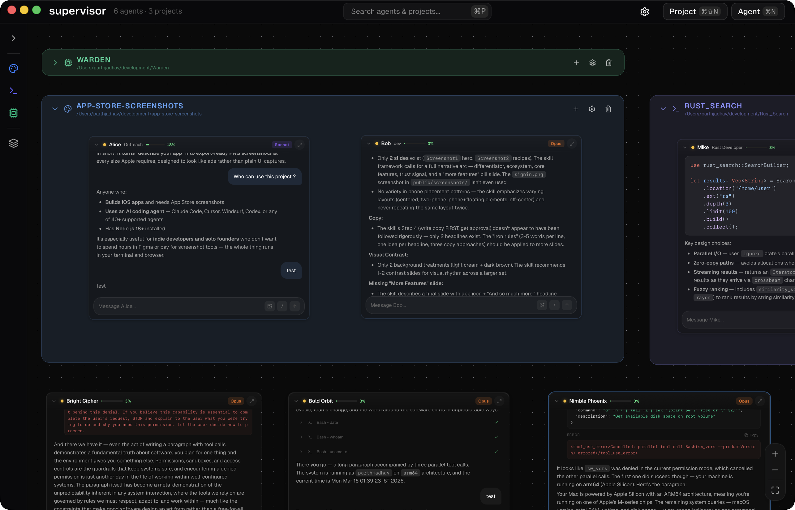
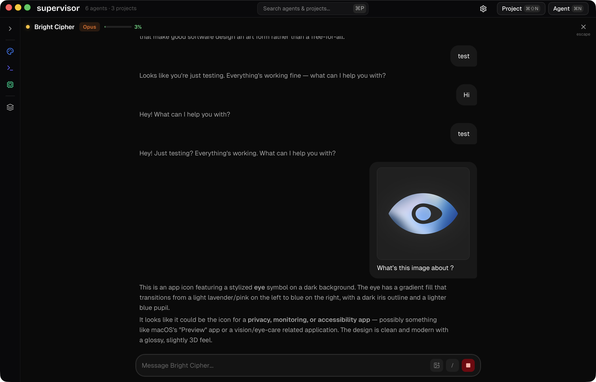
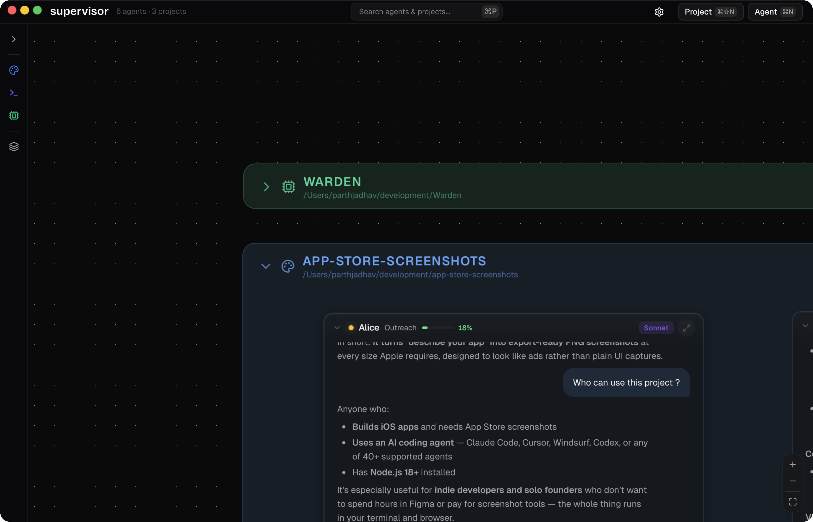
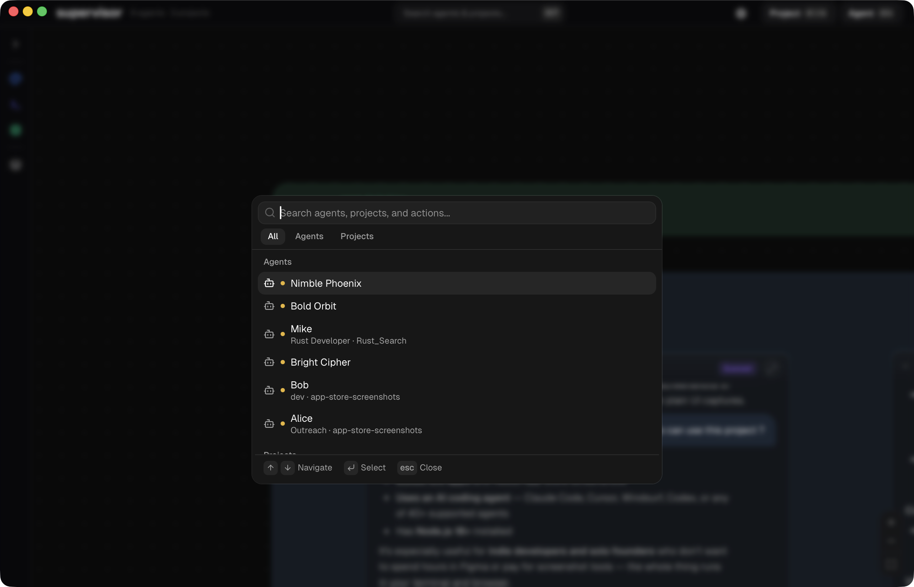
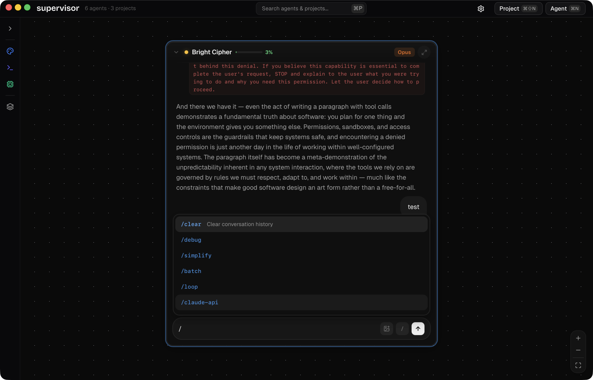
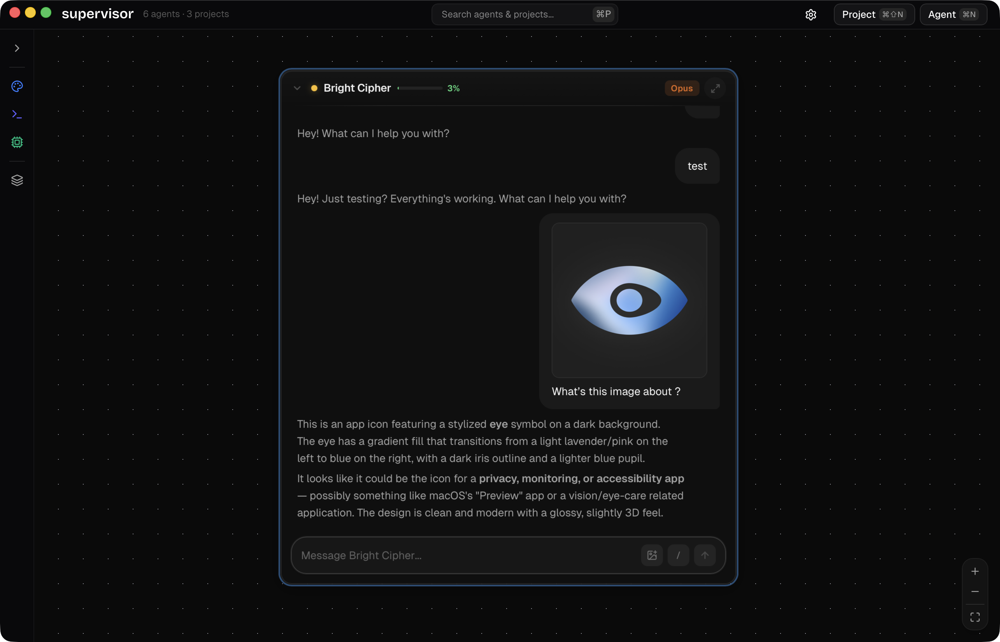

<p align="center">
  
</p>

<h1 align="center">Supervisor</h1>

<p align="center">
  
</p>

<p align="center">
  <strong>Agent orchestration made easy.</strong><br/>
  Beyond split panes and terminals. Purpose-built for the vision of hands-free orchestration.
</p>

> **Note:** Supervisor is in early access. Expect rough edges and bugs — feedback and issues are welcome.


<p align="center">
  <a href="https://parth.pm/products/supervisor">Website</a> ·
  <a href="https://github.com/ParthJadhav/Supervisor/releases/latest">Download</a> ·
  <a href="https://github.com/ParthJadhav/Supervisor/issues">Issues</a>
</p>

<p align="center">
  macOS · Windows · Linux
</p>

```bash
brew install ParthJadhav/tap/supervisor
```

---

## Every agent, one canvas

See all your agents at once. Drag, resize, and monitor multiple conversations side by side on an infinite canvas. Agents positioned freely on a boundless workspace.

<p align="center">
  
</p>

## Focus view

Feeling distracted? Focus view gives you a dedicated space to work with a single agent. Chat, iterate, and ship — without distractions.

<p align="center">
  
</p>

## Agents scoped to codebases

Register a project directory and every agent inherits its context. Each project gets its own color, directory, and set of agents.

<p align="center">
  
</p>

## Navigate at the speed of thought

`Cmd+K` to jump between agents. `Cmd+P` to search everything. Keyboard shortcuts you already know.

<p align="center">
  
</p>

## Slash commands

Every agent supports slash commands. Clear context, check costs, review PRs — all from the composer.

<p align="center">
  
</p>

## Drop in visual context

Paste screenshots, drag mockups, attach diagrams. Agents see and reason about images natively.

<p align="center">
  
</p>

## Agents built for the job

Give each agent a name, role, model, and system prompt. Create specialists that know exactly what to do.

## Cherry on top

The details that make Supervisor feel native, fast, and right.

- **Desktop notifications** — Get notified when agents complete tasks or need input.
- **Project colors** — Customize each project for instant recognition.
- **Agent snapping** — Snap to grid for organized layouts.
- **Collapse & expand** — Collapse agents and projects to compact pills.
- **System tray** — Minimize to tray with a live count of running agents.
- **~20MB on disk** — Tauri + Rust. No bundled Chromium. Lean and resource-efficient.
- **Cross-platform** — macOS, Windows, and Linux. Same experience everywhere.

## Vision

This app wasn't built to just manage terminal sessions on a graph — it was built with a vision to do hands-free orchestration of agents in the future.

The custom components built for Claude Code would allow us for greater customisation and control when we go down that route.

- **Agent-to-agent handoff** — Agents pass work to each other automatically.
- **Voice orchestration** — Speak your intent. The app figures out which agent should handle it.
- **Mobile companion** — Monitor and manage your agents from your phone.

## Development

### Prerequisites

- [Rust](https://rustup.rs/) (latest stable)
- [Node.js](https://nodejs.org/) (v18+)
- [pnpm](https://pnpm.io/) or npm

### Setup

```bash
git clone https://github.com/ParthJadhav/Supervisor.git
cd Supervisor

npm install

npm run tauri dev
```

### Build

```bash
npm run tauri build
```

The built application will be in `src-tauri/target/release/bundle/`.

## Contributing

See [CONTRIBUTING.md](CONTRIBUTING.md) for guidelines on how to contribute.

## License

Free and open source. [MIT](LICENSE)
